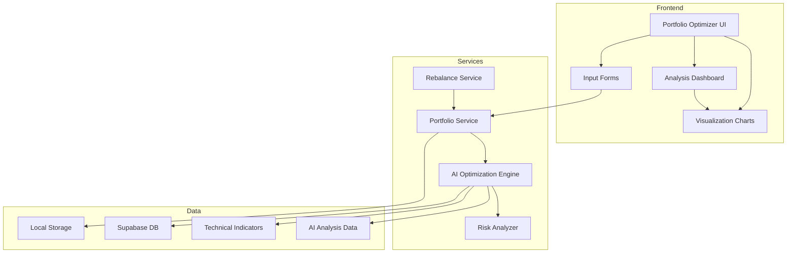

# Design Document: AI Portfolio Optimizer

## Overview

AI Portfolio Optimizer là module giúp nhà đầu tư tối ưu hóa danh mục đầu tư thông qua phân tích AI. Hệ thống sử dụng các thuật toán tối ưu hóa danh mục kết hợp với SENAI Score để đề xuất phân bổ tài sản phù hợp với risk profile của từng người dùng.

## Architecture



## Components and Interfaces

### 1. PortfolioOptimizer Component (Main)

```typescript
interface PortfolioOptimizerProps {
  isDark?: boolean;
}

// Main component managing the portfolio optimization flow
```

### 2. Portfolio Data Structures

```typescript
interface PortfolioStock {
  symbol: string;
  quantity: number;
  avgPrice: number;
  currentPrice?: number;
  value?: number;
  weight?: number;
  pnl?: number;
  pnlPercent?: number;
  senaiScore?: number;
  sector?: string;
}

interface Portfolio {
  id: string;
  name: string;
  stocks: PortfolioStock[];
  totalValue: number;
  totalCost: number;
  totalPnl: number;
  totalPnlPercent: number;
  createdAt: string;
  updatedAt: string;
}

interface RiskProfile {
  type: 'conservative' | 'balanced' | 'growth' | 'aggressive';
  score: number; // 0-100
  description: string;
  targetAllocation: {
    highRisk: number;    // % for SENAI Score < 50
    mediumRisk: number;  // % for SENAI Score 50-70
    lowRisk: number;     // % for SENAI Score > 70
  };
}
```

### 3. Analysis Interfaces

```typescript
interface PortfolioHealthScore {
  overall: number;           // 0-100
  diversification: number;   // 0-100
  risk: number;              // 0-100
  momentum: number;          // 0-100
  quality: number;           // 0-100
  valuation: number;         // 0-100
}

interface PortfolioAnalysis {
  healthScore: PortfolioHealthScore;
  strengths: string[];       // Top 3 strengths
  weaknesses: string[];      // Top 3 weaknesses
  warnings: PortfolioWarning[];
  sectorAllocation: SectorAllocation[];
  correlationMatrix: CorrelationMatrix;
}

interface PortfolioWarning {
  type: 'high_risk' | 'concentration' | 'correlation' | 'sector_imbalance';
  severity: 'low' | 'medium' | 'high';
  message: string;
  affectedStocks?: string[];
}

interface SectorAllocation {
  sector: string;
  weight: number;
  stockCount: number;
  avgSenaiScore: number;
}

interface CorrelationMatrix {
  symbols: string[];
  matrix: number[][];  // NxN correlation values
  highCorrelationPairs: { stock1: string; stock2: string; correlation: number }[];
}
```

### 4. Optimization Interfaces

```typescript
interface OptimizationResult {
  originalPortfolio: Portfolio;
  optimizedPortfolio: Portfolio;
  actions: OptimizationAction[];
  comparison: PortfolioComparison;
  reasoning: string[];
}

interface OptimizationAction {
  type: 'buy' | 'sell' | 'hold';
  symbol: string;
  quantity: number;
  reason: string;
  impact: {
    diversificationChange: number;
    riskChange: number;
    expectedReturnChange: number;
  };
}

interface PortfolioComparison {
  before: {
    expectedReturn: number;
    riskScore: number;
    diversificationScore: number;
    healthScore: number;
  };
  after: {
    expectedReturn: number;
    riskScore: number;
    diversificationScore: number;
    healthScore: number;
  };
}

interface RebalanceSuggestion {
  stock: PortfolioStock;
  currentWeight: number;
  targetWeight: number;
  drift: number;
  action: 'buy' | 'sell';
  quantity: number;
  estimatedCost: number;
}
```

### 5. Risk Profile Assessment

```typescript
interface RiskQuestion {
  id: string;
  question: string;
  options: {
    value: number;  // 1-4 (conservative to aggressive)
    label: string;
  }[];
}

const RISK_QUESTIONS: RiskQuestion[] = [
  {
    id: 'investment_horizon',
    question: 'Thời gian đầu tư dự kiến của bạn?',
    options: [
      { value: 1, label: 'Dưới 1 năm' },
      { value: 2, label: '1-3 năm' },
      { value: 3, label: '3-5 năm' },
      { value: 4, label: 'Trên 5 năm' }
    ]
  },
  {
    id: 'loss_tolerance',
    question: 'Nếu danh mục giảm 20%, bạn sẽ?',
    options: [
      { value: 1, label: 'Bán ngay để cắt lỗ' },
      { value: 2, label: 'Bán một phần' },
      { value: 3, label: 'Giữ nguyên và chờ đợi' },
      { value: 4, label: 'Mua thêm để trung bình giá' }
    ]
  },
  // ... more questions
];
```

## Data Models

### Portfolio Storage (Local Storage)

```typescript
interface StoredPortfolio {
  portfolios: Portfolio[];
  riskProfile: RiskProfile | null;
  settings: {
    rebalanceThreshold: number;  // Default 5%
    autoSave: boolean;
  };
}
```

### Database Tables (Existing)

- `companies` - Thông tin công ty VN100
- `technical_indicators` - Chỉ số kỹ thuật và SENAI Score
- `ai_analysis` - Dữ liệu chẩn đoán SenAI
- `stock_prices` - Giá cổ phiếu

## Correctness Properties

*A property is a characteristic or behavior that should hold true across all valid executions of a system-essentially, a formal statement about what the system should do. Properties serve as the bridge between human-readable specifications and machine-verifiable correctness guarantees.*

### Property 1: Portfolio value calculation consistency
*For any* portfolio with stocks and quantities, the total value should equal the sum of (quantity × currentPrice) for all stocks, and weights should sum to 100%.
**Validates: Requirements 1.3**

### Property 2: Portfolio save/load round-trip
*For any* valid portfolio, saving to local storage then loading should return an equivalent portfolio with all data preserved.
**Validates: Requirements 1.4**

### Property 3: Risk profile classification determinism
*For any* set of risk assessment answers, the classification should always produce one of exactly 4 risk profiles (conservative, balanced, growth, aggressive) with a score between 0-100.
**Validates: Requirements 2.2**

### Property 4: Health score bounds
*For any* valid portfolio, the Portfolio Health Score and all sub-scores should be between 0 and 100 inclusive.
**Validates: Requirements 3.1**

### Property 5: Strengths and weaknesses count
*For any* portfolio analysis, the system should identify exactly 3 strengths and exactly 3 weaknesses.
**Validates: Requirements 3.3**

### Property 6: Low SENAI Score warning generation
*For any* portfolio containing at least one stock with SENAI Score below 35, the analysis should include a high_risk warning.
**Validates: Requirements 3.4**

### Property 7: Optimization produces valid portfolio
*For any* input portfolio and risk profile, the optimization should produce a valid portfolio where all weights are non-negative and sum to 100%.
**Validates: Requirements 4.1**

### Property 8: Optimization actions are actionable
*For any* optimization result, each action should have a valid type (buy/sell/hold), a valid symbol from VN100, and a non-negative quantity.
**Validates: Requirements 4.3**

### Property 9: Correlation matrix symmetry
*For any* portfolio with 2+ stocks, the correlation matrix should be symmetric (matrix[i][j] === matrix[j][i]) and diagonal values should be 1.
**Validates: Requirements 5.1**

### Property 10: High correlation warning
*For any* portfolio where any pair of stocks has correlation > 0.7, a correlation warning should be generated.
**Validates: Requirements 5.2**

### Property 11: Sector concentration warning
*For any* portfolio where a single sector exceeds 40% allocation, a sector_imbalance warning should be generated.
**Validates: Requirements 5.4**

### Property 12: Rebalancing threshold respect
*For any* portfolio with drift exceeding the configured threshold, rebalancing suggestions should be generated; if drift is below threshold, no suggestions should be generated.
**Validates: Requirements 6.1, 6.4**

### Property 13: Rebalancing quantity validity
*For any* rebalancing suggestion, the suggested quantity should be a positive integer and the action should correctly reflect whether to buy or sell.
**Validates: Requirements 6.2**

## Error Handling

### Input Validation Errors
- Invalid stock symbol → Show error message, prevent addition
- Negative quantity → Show error message, require positive number
- Invalid price → Show error message, require positive number

### Calculation Errors
- Missing price data → Use last available price, show warning
- Empty portfolio → Show empty state with guidance
- API failure → Show cached data if available, retry option

### Optimization Errors
- Insufficient data → Show partial analysis with explanation
- No valid optimization → Inform user portfolio is already optimal

## Testing Strategy

### Unit Testing
- Test portfolio calculation functions (value, weight, PnL)
- Test risk profile classification logic
- Test health score calculation
- Test correlation matrix generation
- Test rebalancing calculation

### Property-Based Testing
- Use fast-check library for TypeScript
- Generate random portfolios and verify invariants
- Test edge cases: empty portfolio, single stock, max stocks
- Verify all properties listed in Correctness Properties section

### Integration Testing
- Test data flow from input to analysis
- Test local storage persistence
- Test integration with Supabase data
